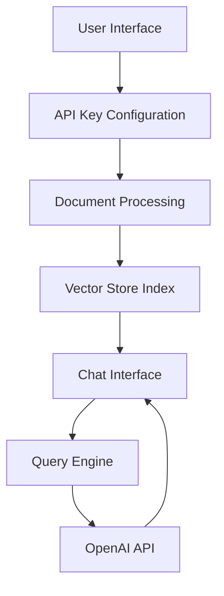

# Talk to PDF 🤖📑


[](https://talk-to-pdf.streamlit.app/)

## Project Summary

Talk to PDF is an innovative web application that enables natural language interaction with PDF documents through an AI-powered interface. The project leverages cutting-edge technologies including OpenAI's language models and LlamaIndex for document processing to create a seamless question-answering system for PDF content.

The application follows a multi-page architecture built on Streamlit, with three primary components:
1. API Configuration Interface
2. Document Upload and Processing System
3. Interactive Chat Interface

The system processes uploaded PDFs through a sophisticated pipeline that includes document indexing, vector storage creation, and context-aware response generation. This architecture enables users to extract information from PDFs through natural conversation rather than manual searching.

### Technical Architecture

The application is structured using a modular approach with clear separation of concerns:

```python
talk_to_pdf/
├── 0_🔌API_KEY.py          # API configuration entry point
├── functions.py            # Shared utility functions
└── pages/
    ├── 1_📑UPLOAD_PDF.py   # Document processing
    └── 2_💬CHAT_WITH_PDF.py # Chat interface
```

The system utilizes Streamlit's session state management for maintaining application state and LlamaIndex for document processing and retrieval operations. This architecture ensures efficient document handling and responsive user interactions.

## Key Features

### 1. Intelligent PDF Processing

The application implements advanced PDF processing capabilities using LlamaIndex and OpenAI's embedding models. The document processing pipeline includes:

```python
def load_document(uploaded_files):
    temp_dir = tempfile.TemporaryDirectory()
    for file in uploaded_files:
        temp_filepath = os.path.join(temp_dir.name, file.name)
        with open(temp_filepath, "wb") as f:
            f.write(file.getvalue())
    reader = SimpleDirectoryReader(input_dir=temp_dir.name)
    docs = reader.load_data()
    return docs
```

This implementation ensures efficient document handling while maintaining document integrity and security.

### 2. Context-Aware Question Answering

The system employs a sophisticated chat engine that maintains conversation context and generates accurate responses:

```python
custom_prompt = PromptTemplate("""\
Given a conversation (between Human and Assistant) and a follow up message from Human, \
rewrite the message to be a standalone question that captures all relevant context \
from the conversation.
""")

chat_engine = CondenseQuestionChatEngine.from_defaults(
    query_engine=query_engine, 
    condense_question_prompt=custom_prompt,
    chat_history=custom_chat_history
)
```

This feature enables natural conversation flow while maintaining context accuracy throughout the interaction.

### 3. Real-Time Response Streaming

The application implements streaming responses for improved user experience:

```python
def conversational_chat(query):
    streaming_response = chat_engine.stream_chat(query)
    response_tokens = []
    for token in streaming_response.response_gen:
        response_tokens.append(token)
    return ''.join(response_tokens)
```

This implementation provides immediate feedback while processing complex queries.

### 4. Flexible Model Selection

Users can customize their experience by selecting different language models and adjusting response parameters:

```python
model_name = st.selectbox("Select the model you want to use",
                         ("gpt-3.5-turbo","gpt-4"))
temperature = st.slider("Set temperature", 0.1, 1.0, 0.5, 0.1)
```

## Benefits

### 1. Enhanced Document Analysis Efficiency

The application significantly reduces the time required to extract information from PDF documents through:
- Instant access to document content through natural language queries
- Context-aware responses that understand document structure
- Efficient document indexing for quick retrieval of relevant information

### 2. User-Friendly Interface

The application provides several usability advantages:
- Progressive disclosure of functionality through a step-by-step interface
- Clear visual feedback for all operations
- Intuitive chat-based interaction model
- Customizable response parameters for different use cases

### 3. Technical Advantages

The implementation offers several technical benefits:
- Scalable architecture supporting multiple document formats
- Efficient memory management through temporary file handling
- Secure document processing with proper cleanup
- Modular design enabling easy feature additions and modifications

### 4. Integration Capabilities

The application's architecture facilitates easy integration with existing systems through:
- Clear API-based communication
- Standardized document processing pipeline
- Modular component structure
- Session-based state management

The Talk to PDF project represents a significant advancement in document interaction technology, combining sophisticated AI capabilities with a user-friendly interface to create a powerful tool for document analysis and information extraction.

# Talk to PDF - Architectural Overview

## System Architecture

The Talk to PDF application implements a modern, modular architecture built on the Streamlit framework, leveraging OpenAI's language models and LlamaIndex for document processing. The system follows a three-tier architecture pattern with clear separation of concerns:

1. **Presentation Layer**: Streamlit-based user interface
2. **Processing Layer**: Document indexing and query processing
3. **Integration Layer**: OpenAI API integration and vector storage

### Architecture Diagram



## Core Components

### 1. API Key Configuration Module

The API key configuration module (`0_🔌API_KEY.py`) serves as the entry point for the application, implementing a secure way to handle OpenAI API credentials:

```python
def handle_api_key():
    api_key = st.text_input("Enter your OpenAI API key", type="password")
    st.session_state['api_key'] = api_key
    if not api_key:
        st.sidebar.warning("⚠️ Please enter OpenAI API key")
    else:
        openai.api_key = api_key
```

This component features:
- Secure password-masked input
- Session state persistence
- Automatic validation
- Seamless navigation flow

### 2. Document Processing Engine

The document processing engine (`pages/1_📑UPLOAD_PDF.py`) handles PDF upload and indexing operations. It utilizes LlamaIndex for efficient document processing:

```python
def query_engine(docs, model_name, temperature):    
    llm = OpenAI(model=model_name, temperature=temperature)
    with st.spinner("Indexing document..."):
        index = VectorStoreIndex.from_documents(docs, llm=llm)
    with st.spinner("Creating query engine..."):
        query_engine = index.as_query_engine()
    return query_engine
```

Key features include:
- Multiple PDF file support
- Automatic document indexing
- Vector store creation
- Configurable model parameters

### 3. Chat Interface System

The chat interface (`pages/2_💬CHAT_WITH_PDF.py`) implements an interactive conversation system with context-aware responses:

```python
custom_prompt = PromptTemplate("""\
Given a conversation (between Human and Assistant) and a follow up message from Human, \
rewrite the message to be a standalone question that captures all relevant context \
from the conversation.

<Chat History> 
{chat_history}

<Follow Up Message>
{question}

<Standalone question>
""")
```

Notable features:
- Streaming responses
- Chat history management
- Context-aware question processing
- Custom prompt templates

## Data Flow Architecture

### 1. Input Processing Flow

The application implements a sequential data flow pattern:

1. **API Key Validation**
   - User inputs API key
   - System validates and stores in session state
   - Enables access to document processing

2. **Document Processing Pipeline**
   - PDF upload triggers document reader
   - Content extraction and preprocessing
   - Vector index generation
   - Storage in session state

3. **Query Processing Chain**
   - User input captured
   - Context integration
   - Query reformation
   - Response generation and streaming

### 2. State Management

The application utilizes Streamlit's session state for persistent data management:

```python
if 'history' not in st.session_state:
    st.session_state['history'] = []
if 'generated' not in st.session_state:
    st.session_state['generated'] = ["Hello! Ask me anything about the uploaded document 🤗"]
if 'past' not in st.session_state:
    st.session_state['past'] = ["Hey! 👋"]
```

Key state components:
- API key storage
- Document index persistence
- Chat history management
- Query engine state

## Technical Implementation Details

### 1. Vector Store Implementation

The system uses LlamaIndex's VectorStoreIndex for efficient document querying:

```python
def load_document(uploaded_files):
    temp_dir = tempfile.TemporaryDirectory()
    for file in uploaded_files:
        temp_filepath = os.path.join(temp_dir.name, file.name)
        with open(temp_filepath, "wb") as f:
            f.write(file.getvalue())
    reader = SimpleDirectoryReader(input_dir=temp_dir.name)
    docs = reader.load_data()
    return docs
```

### 2. Chat Engine Configuration

The chat engine implements a custom configuration for context-aware responses:

```python
chat_engine = CondenseQuestionChatEngine.from_defaults(
    query_engine=query_engine, 
    condense_question_prompt=custom_prompt,
    chat_history=custom_chat_history
)
```

## Architectural Decisions and Rationale

### 1. Technology Choices

- **Streamlit**: Selected for rapid development and interactive UI capabilities
- **LlamaIndex**: Chosen for efficient document processing and vector storage
- **OpenAI Integration**: Provides powerful language understanding capabilities

### 2. Design Patterns

The application implements several key design patterns:

1. **Modular Architecture**
   - Separate pages for distinct functionality
   - Centralized utility functions
   - Clear component boundaries

2. **State Management Pattern**
   - Session-based state persistence
   - Centralized state management
   - Clear state initialization

3. **Stream Processing Pattern**
   - Real-time response streaming
   - Asynchronous document processing
   - Progressive UI updates

This architecture ensures scalability, maintainability, and a smooth user experience while maintaining robust security and performance characteristics.

# Component Breakdown: Talk to PDF System

## API Configuration Module

The API Configuration module serves as the initial entry point for the Talk to PDF application, handling OpenAI API key validation and storage. This component is crucial for enabling the AI-powered functionality throughout the application.

### Primary Functions

1. **API Key Input and Validation**
   - Provides a secure input interface for users to enter their OpenAI API key
   - Validates the key format and stores it in the session state
   - Manages the transition to the PDF upload page upon successful configuration

### Implementation Details

The module is implemented in `0_🔌API_KEY.py` and utilizes Streamlit's session state management for persistent storage. Key features include:

```python
st.set_page_config(page_title="Talk to PDF", page_icon=":robot_face:", layout="wide")
st.title("Talk to your PDF 🤖 📑️")

api_key = st.text_input("Enter your OpenAI API key", type="password")
st.session_state['api_key'] = api_key

if not api_key:
    st.sidebar.warning("⚠️ Please enter OpenAI API key")
else:
    openai.api_key = api_key
```

The module implements secure key storage using password-masked input and provides immediate feedback through the sidebar. Upon successful key submission, it triggers a page transition:

```python
submit = st.button("Submit", use_container_width=True)
if submit:
    st.sidebar.success("✅ API key entered successfully")
    time.sleep(1.5)
    switch_page('upload pdf')
```

## Document Processing Module

The Document Processing module handles PDF file uploads, document indexing, and vector store creation. This component transforms raw PDF documents into queryable knowledge bases.

### Primary Functions

1. **Document Upload Handling**
   - Manages file uploads through Streamlit's file uploader
   - Validates PDF file format
   - Creates temporary storage for document processing

2. **Document Indexing**
   - Processes PDF content using LlamaIndex
   - Creates vector embeddings for efficient querying
   - Establishes the query engine for chat functionality

### Implementation Details

Located in `pages/1_📑UPLOAD_PDF.py`, the module implements sophisticated document processing:

```python
def load_document(uploaded_files):
    temp_dir = tempfile.TemporaryDirectory()
    for file in uploaded_files:
        temp_filepath = os.path.join(temp_dir.name, file.name)
        with open(temp_filepath, "wb") as f:
            f.write(file.getvalue())

    reader = SimpleDirectoryReader(input_dir=temp_dir.name)
    docs = reader.load_data()
    return docs
```

The indexing process utilizes OpenAI's language models for creating searchable document representations:

```python
def query_engine(docs, model_name, temperature):    
    llm = OpenAI(model=model_name, temperature=temperature)
    Settings.llm = llm
    with st.spinner("Indexing document..."):
        index = VectorStoreIndex.from_documents(docs, llm=llm)
    with st.spinner("Creating query engine..."):
        query_engine = index.as_query_engine()
    
    st.session_state['index'] = index
    st.session_state['query_engine'] = query_engine
    return query_engine
```

## Chat Interface Module

The Chat Interface module provides an interactive environment for users to query their PDF documents using natural language. This component handles the conversation flow and response generation.

### Primary Functions

1. **Chat Management**
   - Maintains conversation history
   - Handles user input processing
   - Manages response streaming and display

2. **Context-Aware Question Answering**
   - Reformulates questions to maintain context
   - Generates relevant responses using the query engine
   - Streams responses for better user experience

### Implementation Details

Implemented in `pages/2_💬CHAT_WITH_PDF.py`, the module uses a custom prompt template for context-aware responses:

```python
custom_prompt = PromptTemplate("""\
Given a conversation (between Human and Assistant) and a follow up message from Human, \
rewrite the message to be a standalone question that captures all relevant context \
from the conversation.

<Chat History> 
{chat_history}

<Follow Up Message>
{question}

<Standalone question>
""")
```

The chat engine implementation includes streaming capabilities for real-time response generation:

```python
def conversational_chat(query):
    streaming_response = chat_engine.stream_chat(query)
    response_tokens = []
    for token in streaming_response.response_gen:
        response_tokens.append(token)
    return ''.join(response_tokens)
```

### Component Interactions

The three modules work together in a sequential flow:

1. The API Configuration module initializes the OpenAI client and enables AI functionality
2. The Document Processing module uses the configured API to create document indices
3. The Chat Interface module leverages both the API configuration and document indices to provide interactive question-answering capabilities

This architecture ensures a smooth user experience while maintaining separation of concerns and modularity in the codebase.

## Error Handling and State Management

Each component implements robust error handling and state management:

- API Configuration validates keys and provides clear feedback
- Document Processing includes upload validation and processing status indicators
- Chat Interface maintains conversation state and handles streaming errors gracefully

The application uses Streamlit's session state for persistent storage across components, ensuring a seamless user experience throughout the interaction flow.

# Technology Stack Documentation - Talk to PDF

## Core Technologies

### Python
- **Version**: 3.11 (specified in devcontainer.json)
- **Role**: Primary programming language for the application
- **Justification**: Python was chosen for its extensive machine learning and NLP libraries, excellent web framework support through Streamlit, and seamless integration with OpenAI's APIs. The language's readability and extensive package ecosystem make it ideal for rapid development of AI-powered applications.

### Streamlit
- **Version**: 1.38.0
- **Role**: Web application framework and user interface
- **Justification**: Streamlit provides a rapid development environment for data-focused applications with minimal frontend code. Its built-in components and session state management make it perfect for creating interactive AI applications.

Example usage from `0_🔌API_KEY.py`:
```python
st.set_page_config(page_title="Talk to PDF", page_icon=":robot_face:", layout="wide")
st.title("Talk to your PDF 🤖 📑️")
api_key = st.text_input("Enter your OpenAI API key", type="password")
```

### OpenAI Integration
- **Version**: 1.43.0
- **Role**: Natural language processing and question answering
- **Justification**: OpenAI's GPT models provide state-of-the-art natural language understanding and generation capabilities, essential for accurate PDF content analysis and question answering.

Implementation example from `functions.py`:
```python
def query_engine(docs, model_name, temperature):    
    llm = OpenAI(model=model_name, temperature=temperature)
    Settings.llm = llm
    index = VectorStoreIndex.from_documents(docs, llm=llm)
    query_engine = index.as_query_engine()
    return query_engine
```

## Document Processing Stack

### LlamaIndex
- **Version**: 0.11.3
- **Role**: Document indexing and retrieval system
- **Justification**: LlamaIndex provides sophisticated document processing capabilities with built-in support for various document types and vector storage systems. It seamlessly integrates with OpenAI's embeddings for efficient document querying.

Key components:
- `VectorStoreIndex`: Document indexing and retrieval
- `SimpleDirectoryReader`: PDF file processing
- `CondenseQuestionChatEngine`: Context-aware question answering

Example implementation:
```python
from llama_index.core import VectorStoreIndex, SimpleDirectoryReader
reader = SimpleDirectoryReader(input_dir=temp_dir.name)
docs = reader.load_data()
index = VectorStoreIndex.from_documents(docs, llm=llm)
```

### PyPDF
- **Version**: 4.3.1
- **Role**: PDF file processing and text extraction
- **Justification**: Provides robust PDF parsing capabilities with support for various PDF formats and structures.

## UI Components and Extensions

### Streamlit Extensions
- **streamlit-chat**: Version 0.1.1 - Provides chat interface components
- **streamlit-extras**: Version 0.4.7 - Additional UI utilities
- **streamlit-faker**: Version 0.0.3 - Test data generation
- **markdownlit**: Version 0.0.7 - Enhanced markdown rendering

These extensions enhance the base Streamlit functionality with specialized components for chat interfaces and improved user experience.

## Dependency Management

### Requirements Management
The project uses `pip` and `requirements.txt` for dependency management. The requirements file is compiled using `pip-compile`, ensuring reproducible builds across environments.

Key dependencies are organized into categories:
- Core dependencies (Python packages)
- UI components (Streamlit and extensions)
- AI/ML libraries (OpenAI, LlamaIndex)
- Utility packages (typing, packaging, etc.)

Installation process:
```bash
pip install -r requirements.txt
```

### Version Control
Dependencies are strictly versioned to ensure consistency:
```txt
streamlit==1.38.0
openai==1.43.0
llama-index==0.11.3
pypdf==4.3.1
```


## 📝 License

This project is [MIT](https://choosealicense.com/licenses/mit/) licensed.

## 📬 Contact

Author - [Kaushal](https://www.linkedin.com/in/kaushal-powar-a52b1a159/)

Project Link: [https://github.com/yourusername/talk-to-pdf](https://github.com/yourusername/talk-to-pdf)

---

Enjoy interacting with your PDFs using natural language! 🚀📄
